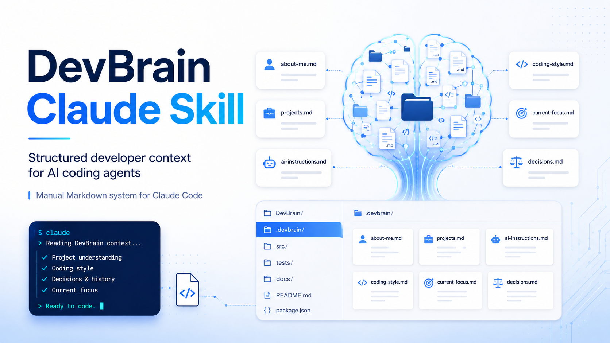

# DevBrain Claude Skill



DevBrain gives AI coding agents structured developer context using simple Markdown files.

Instead of re-explaining who you are, what you are building, how you write code, and what decisions you already made at the start of every session, you keep that context in a small `brain/` folder. Claude Code reads it and works from it.

DevBrain v0.1 is **manual Markdown only**. There is no CLI, no MCP server, no database, and no automation. You edit plain files by hand, and that is the whole point.

---

## Why DevBrain Exists

Most AI coding sessions start from zero. Developers repeatedly explain:

- who they are
- what they are building
- how their project works
- how they prefer code to be written
- what decisions were already made
- what the AI should avoid

DevBrain turns that repeated explanation into a clean, reusable context layer that travels with your project.

---

## What DevBrain Provides

A lightweight folder of context files plus a `CLAUDE.md` that tells Claude Code to read them first.

```text
.
├── CLAUDE.md            # tells Claude Code to read the brain/ folder first
├── brain/               # your developer + project context
│   ├── about-me.md
│   ├── projects.md
│   ├── ai-instructions.md
│   ├── coding-style.md
│   ├── current-focus.md
│   └── decisions.md
├── commands/            # manual prompt workflows (copy/paste into Claude Code)
│   ├── devbrain-init.md
│   ├── devbrain-update.md
│   └── devbrain-review.md
├── prompts/             # reusable manual prompts
├── docs/                # planned for v0.2
├── examples/            # planned for v0.2
└── roadmap.md
```

---

## Installation / Setup

DevBrain is copied into a project, not installed. There is nothing to build or run.

1. Copy `CLAUDE.md` and the `brain/` folder into the root of your project.
2. Open the project in Claude Code.
3. Fill in the `brain/` files with your own context (the files ship as reusable templates with placeholders like `<your name>`).
4. Start working. Claude Code reads `CLAUDE.md`, which points it at the `brain/` files.

No package to install, no command to run.

---

## Usage Examples

**First-time setup**

Paste this into Claude Code (or open `commands/devbrain-init.md`):

> Initialize DevBrain. Create any missing files in `brain/`, then interview me one section at a time and fill them in.

**Keep context current**

After your focus or a decision changes, paste this:

> Update DevBrain. Ask me what changed, then edit only the relevant `brain/` files and show me a per-file summary.

**Check the brain is still accurate**

Before publishing or after a busy period of changes:

> Review DevBrain. Read all `brain/` files and list anything outdated, contradictory, missing, or too long, grouped by file.

Because the context lives in `brain/`, every later session already knows your stack, style, and current focus without you repeating it.

---

## Brain Files Explained

| File | Purpose |
| --- | --- |
| `about-me.md` | Who you are: role, languages, tools, strengths, preferences. |
| `projects.md` | What you are building: problem, users, tech stack, status, next steps. |
| `ai-instructions.md` | How the AI should respond and what to avoid. |
| `coding-style.md` | How you want code written: naming, structure, what to avoid. |
| `current-focus.md` | What you are working on right now. Keep it short, update often. |
| `decisions.md` | Decisions already made with short reasons, so they are not re-litigated. |

Keep each file short and practical. Long files dilute the useful context.

---

## Manual Commands

The files in `commands/` are **manual prompt workflows**, not executable slash commands.

In v0.1 there is no command runner. You copy the prompt from the file (or use the examples above) and paste it into Claude Code.

- `commands/devbrain-init.md` — set DevBrain up in a project for the first time.
- `commands/devbrain-update.md` — keep the brain files current as the project changes.
- `commands/devbrain-review.md` — check the brain files for accuracy and contradictions.

The `prompts/` folder holds smaller reusable prompts for interview, update, project extraction, and compression, used the same way.

---

## Roadmap

**v0.1 — current**

Manual Markdown only. No tooling. You edit the `brain/` files by hand and Claude Code reads them.

**v0.2 — planned**

- Example brain files for different developer types.
- A short setup guide with screenshots.
- Optional prompt files for guided interviews and updates.

**v0.3 — ideas**

- A small scaffolding helper to create the `brain/` folder structure.
- A helper to summarize and compress long brain files.

**Later — not committed**

- MCP integration.
- A memory or RAG layer for large project histories.
- Sync across machines.

See `roadmap.md` for full detail and the guiding principle.

---

## What DevBrain Is Not

- It is **not** a CLI tool — v0.1 has no commands to run.
- It is **not** an MCP server.
- It is **not** a database, memory engine, or RAG system.
- It is **not** automation — you edit the files yourself.
- It does **not** try to clone your entire mind. It stores the practical context an AI agent needs to be useful.

---

## License

MIT License. See [LICENSE](LICENSE).
